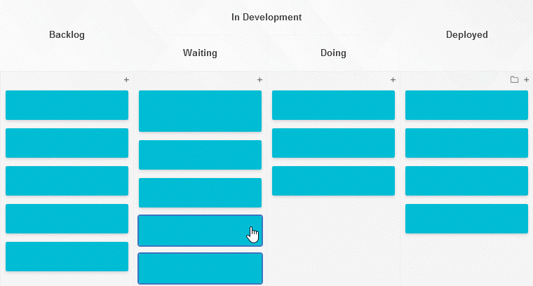

# Software Design & Engineering

## Original Artifact
**Course**: CS-250 – Software Development Lifecycle  
**Artifact**: Sprint Review and Retrospective Document for the SNHU Travel Agile Project  
**Description**: This document detailed application of Scrum/Agile principles, including user stories, team roles (Scrum Master, Developer, Tester), sprint events, adaptability to requirement changes (pivot to wellness travel), and reflections on communication and collaboration.

## Enhancement Description
The static documentation has been transformed into a **functional interactive Kanban board web prototype** using HTML, CSS, and JavaScript.

### Key Enhancements
- Draggable user story cards across columns: Backlog → To Do → In Progress → Done
- Add, edit, and delete user stories dynamically
- LocalStorage persistence (data saved in browser)
- Simple progress visualization (percentage complete)
- Clean, responsive design with accessibility considerations (keyboard support, ARIA labels)

This moves the artifact from theoretical process documentation to a practical, usable Agile tool MVP — demonstrating full application of the Software Development Lifecycle from planning to implementation.

### Alignment with Course Outcomes
- **Outcome 1**: Strategies for collaborative environments through visual, interactive team tools  
- **Outcome 2**: Professional-quality visual and interactive communications  
- **Outcome 3**: Design trade-offs (simplicity vs. functionality in prototype scope)  
- **Outcome 4**: Innovative web techniques for industry-specific Agile/project management goals

### Visuals & Code
[View the enhanced Kanban prototype repository](https://github.com/yourusername/kanban-agile-prototype) *(replace with real link)*

*(Screenshots here)*  
  

This enhancement clearly shows growth in software engineering practices, modularity, and user-centered design.
